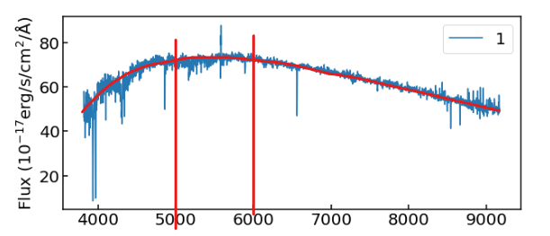
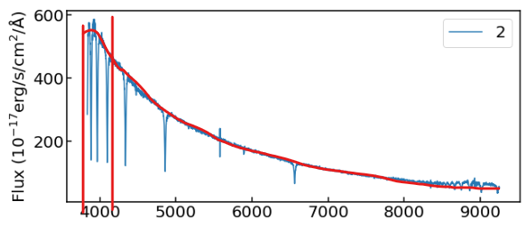
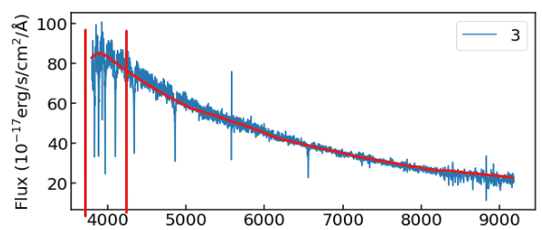
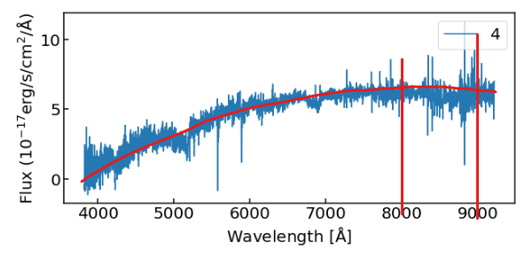

# General Astronomy HW1

b09902004 資工四 郭懷元

## Problem 1

### (a)

$$
\begin{gather*}
\begin{align*}
    m-M &= -2.5 \log_{10}{\frac{10 \space \text{pc}}{3000 \times 10^6 \space \text{pc}}} \\
    &= 5 \log_{10}{\frac{3 \times 10^9}{10}}
\end{align*}\\
\begin{align*}
    M &= m - 5 \log_{10}{(3 \times 10^8)} \\
    &= 22 - 5 \times (8 + \log_{10}{3}) \\
    &\approx -20.39
\end{align*}
\end{gather*}
$$

### (b)

Let $R$ be the signal-to-noise ratio.

$$
\begin{gather*}
\frac{N_{\text{photon, SDSS}}}{N_{\text{photon, GMT}}}
= \frac{d_{\text{SDSS}}^2 \cdot t_{\text{SDSS}} \cdot f}{d_{\text{GMT}}^2 \cdot t_{\text{GMT}} \cdot f} = \frac{d_{\text{SDSS}}^2}{d_{\text{GMT}}^2} = (\frac{2.5}{25.4})^2 \\
\frac{R_{\text{SDSS}}}{R_{\text{GMT}}} = \frac{N_{\text{photon, SDSS}}^{0.5}}{N_{\text{photon, GMT}}^{0.5}} = \frac{2.5}{25.4}\\
R_\text{GMT} = R_\text{SDSS} \times \frac{25.4}{25} = 50.8
\end{gather*}
$$

### (c)

Let $f'$ and $m'$ be the flux and magnitude that satisfies the given condition. Let $f$ be the flux of the galaxy observed with SDSS.

$$
\begin{gather*}
    \begin{align*}
        & \frac{R_\text{GMT, $t=60$, $m'$}}{R_\text{SDSS, $t=60$, $m=22$}} = \frac{5}{5} = 1 \\
        \rArr & \frac{N_\text{photon, GMT, $60$, $m'$}}{N_\text{photon, SDSS, $60$, $22$}} = 1 \\
        \rArr & \frac{d^2_\text{GMT} \times 60 \times f'}{d^2_\text{SDSS} \times 60 \times f} = 1 \rarr \frac{f'}{f} = (\frac{2.5}{25.8})^2 \\
    \end{align*}\\
    m' - m = -2.5 \log_{10}{\frac{f'}{f}} \\
    m' = m - 2.5 \log_{10}{\frac{f'}{f}} = 22 - 2.5\log_{10}{(\frac{2.5}{25.8})^2} \approx 27.07
\end{gather*}
$$

### (d)

Let $t'$ be the time needed.

$$
\begin{gather*}
    \frac{d^2_\text{GMT} \times t' \times f}{d^2_\text{SDSS} \times t \times f} = 1 \\
    t' = t \times \frac{d^2_\text{SDSS}}{d^2_\text{GMT}} = 60 \times (\frac{2.5}{25.4})^2 \space\text{sec} = 0.58 \space\text{sec}
\end{gather*}
$$

---

## Problem 2

Let $d$ be the distance to Mars.

$$
\begin{align*}
    d \cdot \sin{10''} & = \frac{7000}{2} \space\text{km} \\
    d & = \frac{3500}{\sin{10''}} \space\text{km} \\
    & \approx \frac{3500}{\frac{10}{3600} \times \frac{\pi}{180}} \space\text{km} \\
    & \approx 7.219 \times 10^7 \space\text{km}
\end{align*}
$$

---

## Problem 3

### (a)

$$
\begin{align*}
\theta &= \arcsin{\frac{40 \times 10^{12} \space\text{m}}{16 \times 10^6 \space\text{pc}}} \\
&= \arcsin{\frac{40 \times 10^{12} \space\text{m}}{16 * 10^6 * 3 * 10^{16} \space\text{m}}} \\
&\approx \frac{40 \times 10^{12}}{16 * 10^6 * 3 * 10^{16}} \\
&= \frac{40 \times 10^{12}}{16 * 10^6 * 3 * 10^{16}} \times \frac{180 \times 3600}{\pi} \space\text{arcsec} \\
&= 1.719 \times 10^{-5} \space\text{arcsec}
\end{align*}
$$

### (b)

Let $D$ be the required length for baseline.

$$
\begin{align*}
    1.719 \times 10^{-5} & \ge 1.2 \times \frac{1.3 \times 10^{-3} \space\text{m}}{D} \times \frac{3600 \times 180}{\pi} \\
    D & \ge  \frac{1.2 \times 3600 \times 180 \times 1.3 \times 10^{-3}}{1.719 \times 10^{-5} \times \pi}
    \approx 1.872 \times 10^7 \space\text{m}
\end{align*}
$$

### (c)

> Reference:
>
> [Earth - Wikipedia](https://en.wikipedia.org/wiki/Earth)

Earth's mean radius is around $6371.0 \space\text{km}$, or $6.371 \times 10^6 \space\text{m}$. So the baseline's length is roughly $3$ times the Earth's radius, or $1.5$ times its diameter.

---

## Problem 4

### (a)

Since all variable stars observed for this graph are not in the Milky Way galaxy, the distance between us and each of the variable stars can be seen as the same. This also means that the difference between observed and absolute magnitude ($m - M$), which only depends on the distance of observed object, is constant.

Therefore the slope of $m$ to $\log_{10}{P}$ line is the same as $M$ to $\log_{10}{P}$ for our data.

The upper line goes through 2 points: $(0.8, 14)$ and $(2.0, 11.5)$.

$$
\alpha = \frac{11.5-14}{2.0-0.8} \approx -2.08
$$

### (b)

$$
\begin{gather*}
    \begin{align*}
        4.2 - M & = -2.5  \log_{10}{(\frac{10 \space\text{pc}}{200 \space\text{pc}})^2} \\
        M & = 4.2 + 5 \log_{10}{\frac{1}{20}} \\
        & = 4.2 - 5 \log_{10}{20} \\
        & \approx -2.31
    \end{align*}\\
    \begin{align*}
        -2.31 &= -2.08 \log_{10}{6} + \beta \\
        \beta & \approx -0.691
    \end{align*}
\end{gather*}
$$

### (c)

$$
\begin{gather*}
    M = -2.08 \log_{10}{30} - 0.691 \approx -3.76 \\
    m = M - 2.5 \log_{10}{
        (\frac{10 \times 3 \times 10^{16} \space\text{m}}{
            9 \times 10^5 \times 9.46 \times 10^{15} \space\text{m}
        })^2 \approx 18.5
    }
\end{gather*}
$$

---

## Problem 5

> Additional references:
>
> - [The Sunshield Webb/NASA](https://webb.nasa.gov/content/observatory/sunshield.html)

### (a)

Nearly 20 years.

### (b)

L2 Lagrange point, which is around 1.5 million kilometers away from Earth.

### (c)

The detectors and surrounding components need to be kept at a low temperature. The multi layer design can use the vacuum between each layer to insulate heat, so that the heat from outer layer can only be transferred through thermal radiation, which we can also block out using the shields.

### (d)

Thermal radiation. Every object with temperature above 0 K emits electro-magnetic waves. If the parts around detectors are not cooled, they could emit radiations at the wavelengths we want to observe, adding noises to our observation.

### (e)

By Wien's Law:

$$
\begin{gather*}
    \lambda_\text{max} T = 0.0029 \space\text{m} \cdot \text{K} \\
    T = \frac{0.0029 \space\text{m}}{10 \times 10^{-6}\space\text{m}} \space \text{K} = 290 \space \text{K}\\
\end{gather*}
$$

---

## Problem 6

Since Wien's Law only uses the wavelength with maximum flux, we can use it on our observed flux data.

To find $\lambda_\text{max}$, I ignore the emission and absorption lines, then "eyeball" the SED. Then use Wien's Law: $\lambda_\text{max} \cdot T = 2.9 \times 10^7 \space\text{\r{A}} \cdot \text{K}$.

### 1

$$
\begin{gather*}
    5000 \space\text{\r{A}} \lt \lambda_\text{max} \lt 6000 \space\text{\r{A}} \\
    \rArr \frac{2.9 \times 10^7}{6000} \space\text{K} \lt T \lt \frac{2.9 \times 10^7}{5000} \space\text{K} \\
    4833 \space\text{K} \lt T \lt 5800 \space\text{K}
\end{gather*}
$$

### 2

$$
\begin{gather*}
    3800 \space\text{\r{A}} \lt \lambda_\text{max} \lt 4200 \space\text{\r{A}} \\
    \rArr \frac{2.9 \times 10^7}{4200} \space\text{K} \lt T \lt \frac{2.9 \times 10^7}{3800} \space\text{K} \\
    6905 \space\text{K} \lt T \lt 7632 \space\text{K}
\end{gather*}
$$

### 3

$$
\begin{gather*}
    3800 \space\text{\r{A}} \lt \lambda_\text{max} \lt 4200 \space\text{\r{A}} \\
    \rArr \frac{2.9 \times 10^7}{4200} \space\text{K} \lt T \lt \frac{2.9 \times 10^7}{3800} \space\text{K} \\
    6905 \space\text{K} \lt T \lt 7632 \space\text{K}
\end{gather*}
$$

Note that the SED of this star is very similar to star 2 in terms of relative flux at different wavelengths, also the emission and absorption lines lines up almost perfectly. This leads me to believe that red shift's effect has already been cancelled, therefore I don't take it into account during my calculations.

### 4

$$
\begin{gather*}
    8000 \space\text{\r{A}} \lt \lambda_\text{max} \lt 9000 \space\text{\r{A}} \\
    \rArr \frac{2.9 \times 10^7}{9000} \space\text{K} \lt T \lt \frac{2.9 \times 10^7}{8000} \space\text{K} \\
    3222 \space\text{K} \lt T \lt 3625 \space\text{K}
\end{gather*}
$$

---
