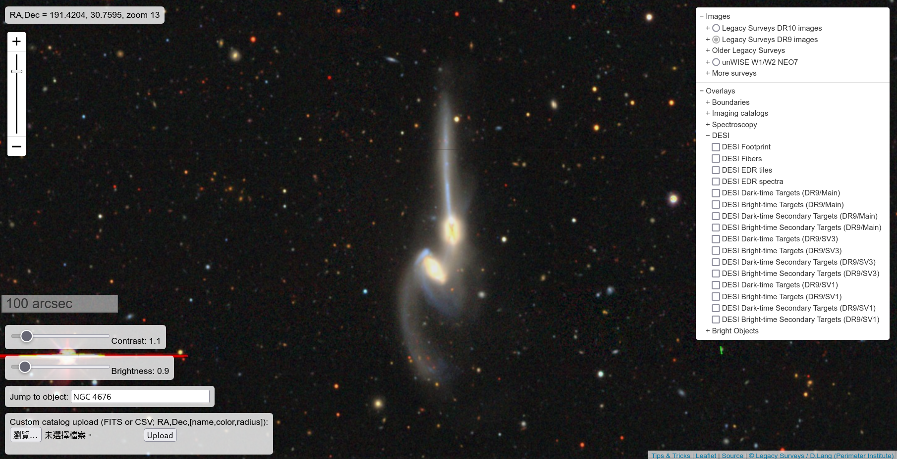
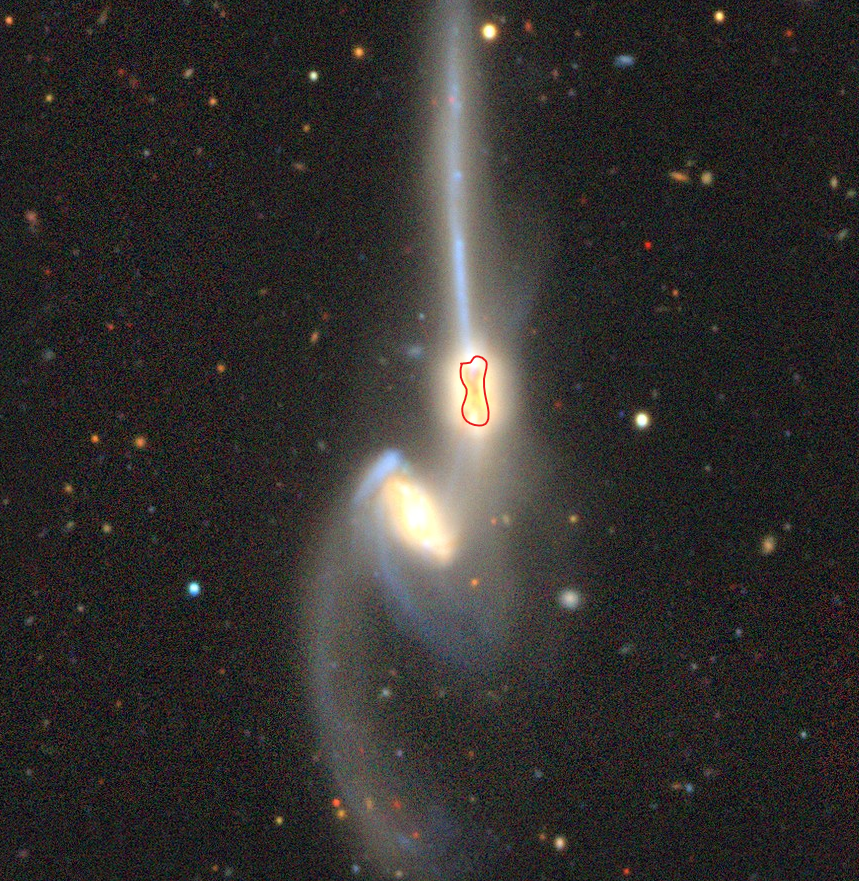

# General Astronomy HW3

b09902004 資工四 郭懷元

## Problem 1

### 1-a

I did see two galaxies merging.

### 1-b

RA, Dec = 191.5467, 30,7236

### 1-c

Right ascension (RA) is essentially the longitude for celestial sphere, and declination (Dec) is the latitude for celestial sphere.

### 1-d

The redshift of these two galaxies are $z_1=0.0217993$ and $z_2=0.0218638$.

Their speed relative to Earth is:

$$
v_1 = z_1 \times c \\
v_2 = z_2 \times c \\
$$

And their relative speed to each other is:

$$
v_\text{rel} = |v_1 - v_2| = |z_1 - z_2| \times c \approx 6.45 \times 10^{-5} \times 3 \times 10^8 \ \text{m/s} \approx 19350 \ \text{m/s}
$$

> Note:
>
> The value I got is quite different from the one I found in [this paper](https://arxiv.org/pdf/1405.7814.pdf) (section 4.2), so I might have missed something.

### 1-e

This could be due to the extinction caused by dusts between the 2 galaxies and Earth. There are some dark patterns right on the core of the upper galaxy, and I believe those can be dusts.

### 1-f

It could be that the observations are made using a smaller telescope, or the observation conditions, such as atmospheric seeing, during that project were not as ideal.

### 1-g

> Reference:
>
> 1. [Wide-field Infrared Survey Explorer - Wikipedia](https://en.wikipedia.org/wiki/Wide-field_Infrared_Survey_Explorer#Mission)

WISE mainly observes in 4 infrared bands, from 3.4 μm to 22 μm, with a diameter of 40 cm.

Compared with SDSS, which observes in visible light with a 2.5 m telescope, WISE's angular resolution is $\frac{22 \ \text{μm}}{5000 \ \text{\r{A}}} \times \frac{2.5 \ \text{m}}{40 \ \text{cm}} = 275$ times larger than SDSS. Therefore WISE's images are much more blurry.

### 1-h

There is usually 1 galaxy the core of each galaxy cluster, and that galaxy is orange-ish, suggesting that it might be a passive galaxy.

### 1-i

The center galaxy probably needs to have a gravitational field strong enough, to keep all the surrounding galaxies close and form the galaxy cluster. Therefore a single star-forming galaxy might not have enough mass, and a massive passive galaxy formed via 1 or several mergers of many galaxies would have enough mass to bound all surrounding galaxies.

---

## Problem 2

### 2-a

They will collide and merge into a red passive galaxy.

### 2-b

Facts about the collision between the Milky Way and Andromeda galaxy.

### 2-c

I don't know why the colors of simulated galaxies seem to differ from that of observed galaxies.

### 2-d

The zooniverse project briefly mentioned in the talk is quite interesting to me, I wonder how they ensure the quality of publicly labeled data.

The lecturer also mentioned that algorithms then are not good at classifying galaxies, but I think that with the massive advances of ML algorithms in the past 5 years, this task could be partially automated now.

---

## Problem 3

> Reference:
>
> 1. [Baldry, I. K., Balogh, M. L., Bower, R., Glazebrook, K., & Nichol, R. C. (2004, December). Color bimodality: Implications for galaxy evolution.](https://arxiv.org/pdf/astro-ph/0410603)

The transformation from a blue galaxy to a red galaxy should happen in a short timescale, relative to the lifetime of a galaxy.

We can assume that during such transformation, the color of the transformed galaxy should change somewhat uniformly. The observed color distribution is bimodal, seemingly well-fitted with 2 Gaussian distribution.

If the transformation takes a relatively long time to complete, we should expect there to be some portion of galaxies in the "midway" colors, and the overall distribution should be 2 Gaussians and 1 additional distribution for the "transforming" galaxies. But since that is not what we observed, the transformation must happen on a short timescale, so that there are rarely any "transforming" galaxies.

---

## Problem 4

> Reference for Sun's characteristics:
>
> 1. [Sun - Wikipedia](https://en.wikipedia.org/wiki/Sun)

### 4-a

For simplicity, I assume that the star goes through the Andromeda-like galaxy without any gravitational interaction with stars in that galaxy. This is because such calculation would require more assumptions about the velocities and directions of stars, and things get too complicated.

First, we calculate the volume that our crossing star would go through:

$$
V_\text{path} = \pi R_\odot^2 \times 1 \ \text{kpc}
\approx 4.700 \times 10^{28} \ \text{km}^3
$$

Then, we can calculate how much volume in $V_\text{path}$ would be stars, assuming that stars are distributed evenly within the disk.

$$
V_\text{stars on path}
= \frac{V_\odot \times 10^{11}}{\pi \times (10 \ \text{kpc})^2 \times {1 \ \text{kpc}}} \times V_\text{path}
= \frac{V_\text{path}}{\pi \ \text{pc}^3} V_\odot
$$

And the total number of stars in the crossing path is:

$$
N_\text{stars on path}
= \frac{V_\text{stars on path}}{V_\odot}
= \frac{V_\text{path}}{\pi \ \text{pc}^3}
\approx 5.092 \times 10^{-13}
$$

So basically no stars would be on the crossing path and no collision would happen.

### 4-b

Assuming all stars in the crossing galaxy will go through the Andromeda-like galaxy the same way as in [4-a](#4-a), then the calculation is simple:

$$
N_\text{total collisions} = N_\text{stars} \times N_\text{stars on path} \approx 5.092 \times 10^{-2}
$$

The expected number of collision is still close to 0.

---

## Problem 5

### 5-a

$$
\begin{gather*}
    {\theta}_E
    = \sqrt{\frac{4GM}{c^2} \frac{D_{ls}}{D_{ol} D_{os}}}
    = \sqrt{\frac{4GM}{c^2 D_{ol}} (1 - \frac{D_{ol}}{D_{ol} + D_{ls}})} \\
    \rArr \argmax_{D_{ls}} {\theta}_E = \max{D_{ls}} = 8 \ \text{kpc} \\
    \begin{align*}
        \rArr \max_{D_{ls}}{{\theta}_E}
        & = \sqrt{\frac{4GM}{c^2} \frac{8 \ \text{kpc}}{8 \ \text{kpc} \times 16 \ \text{kpc}}} \\
        & = \sqrt{\frac{4 \times 4 \times 10^6 G M_\odot}{c^2} \frac{1}{16 \ \text{kpc}}} \\
        & \approx 6.918 \times 10^{-6} \ \text{rad} \\
        & \approx 1.427 \ \text{arcsec}
    \end{align*}
\end{gather*}
$$

### 5-b

> Reference:
>
> 1. [FAQ VLT/Paranal | ESO](https://www.eso.org/public/about-eso/faq/faq-vlt-paranal)

VLTI (multiple VLT telescopes in interferometric mode) has a angular resolution about 0.002 arcsec, so should be more than enough to identify the strong lensing.

### 5-c

In order to have a resolvable and bright distorted image, such star would need to lie within a very thin cone around the supermassive black hole while being distanced enough from it. Considering the sparseness of stars (as calculated in [problem 4](#problem-4)), the chance of having a star with all the right properties seems very low.

Interestingly, a paper ([Observing Gravitational Lensing Effects by Sgr A* with GRAVITY (2012)](https://ui.adsabs.harvard.edu/abs/2012ApJ...753...56B/abstract)) did a much more detailed calculation on this topic, and suggested some candidates to observe.

---
