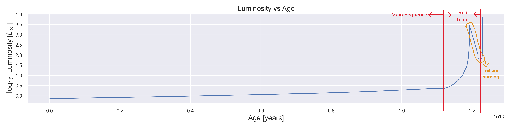
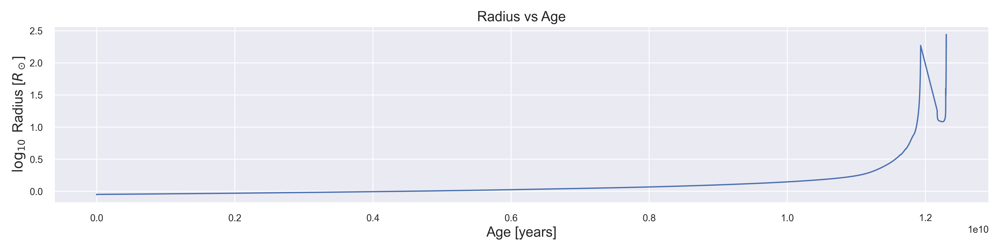
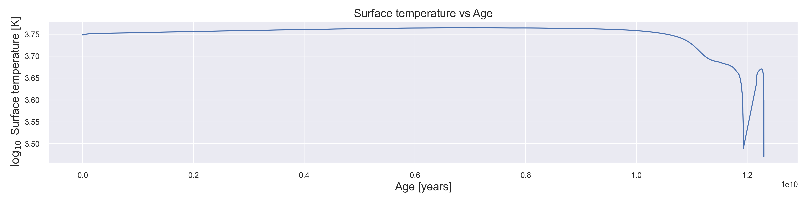
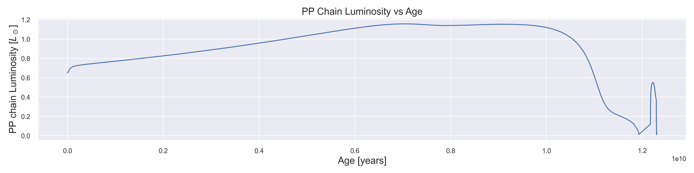
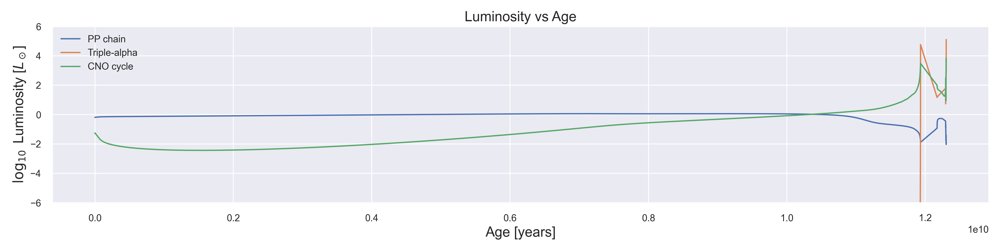
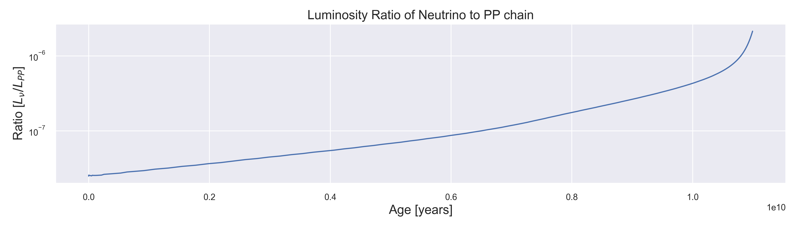
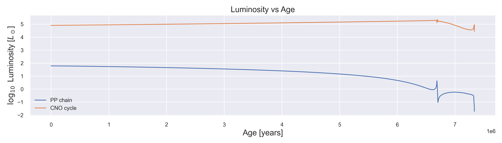
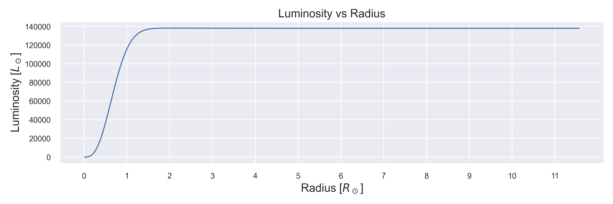

# General Astronomy HW4

b09902004 資工四 郭懷元

## Problem 1

### a b

### c

Radius:

Surface temperature:

### d

The surface temperature increases very slightly with time, then starts to decrease when the star leaves main sequence. There is also a sudden dip right at the beginning of helium fusion.

As for the size, it increases gradually during main sequence, then grows rapidly when the star becomes a red giant. The size shrinks as the helium fusion begin, and finally expands again after the fusion ended.

### e

### f

The p-p chain serves as the main source of energy until about 1010 years into the life cycle. Then the CNO cycle takes places as hydrogen shell burning starts. Finally the triple-alpha reaction begins and generates comparable luminosity to the CNO cycle.

### g

During main sequence, the neutrino luminosity stays between 10-7 and 10-6 the luminosity from p-p chain.

### h

The result matches what was described in the lecture. Most of the luminosity comes from the CNO cycle.

### i

Most of the luminosity comes from fusion between $0.2\ R_\odot$ and $1.5\ R_\odot$.

