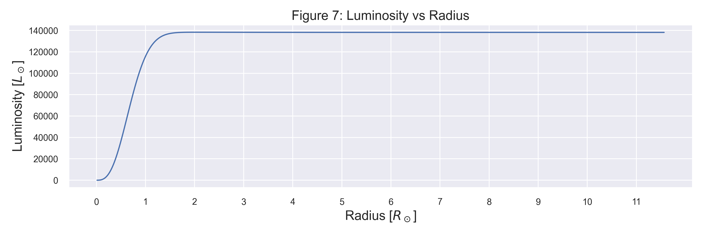

# General Astronomy HW4

b09902004 資工四 郭懷元

## Problem 1

### a b

### c

Radius:

Surface temperature:

### d

The surface temperature increases very slightly with time, then starts to decrease when the star leaves main sequence. There is also a sudden dip right at the beginning of helium fusion.

As for the size, it increases gradually during main sequence, then grows rapidly when the star becomes a red giant. The size shrinks as the helium fusion begin, and finally expands again after the fusion ended.

### e

### f

The p-p chain serves as the main source of energy until about 1010 years into the life cycle. Then the CNO cycle takes places as hydrogen shell burning starts. Finally the triple-alpha reaction begins and generates comparable luminosity to the CNO cycle.

### g

During main sequence, the neutrino luminosity stays between 10-7 and 10-6 the luminosity from p-p chain.

### h

The result matches what was described in the lecture. Most of the luminosity comes from the CNO cycle.

### i

Most of the luminosity comes from fusion between $0.2\ R_\odot$ and $1.5\ R_\odot$.

### j

${\epsilon_\text{CNO}}/{\epsilon_\text{nuc}}$ drops to 50% at around 3.17 $R_\odot$ from the center.

### k

The temperature at 3.17 $R_\odot$ from the center is about 1.415 x 107 K, so not far from 15 million K.

### l

For easier comparison, I plotted the data from both initial conditions in 1 figure:

It seems that with lower metallicity, the luminosity from PP chain is about an order of magnitude higher, while the luminosity from CNO cycle is close.

I think the reason for this difference is that the heavier metal atoms might make PP chain more difficult to be triggered.

### m

[Source Code (secret gist)](https://gist.github.com/GWFrank/7f46d7294fe52097d524aa58fb7414f1)

---

## Problem 2

### a

The data were recorded by "chart recorders" on to chart papers. They looked like long, squiggly lines.

### b

He thought that it was caused by interference due to some faulty wiring of their self-made radio telescope.

### c

I think her determination of becoming an astronomy researcher is really impressive. She had known what she wanted to do ever since a very young age, and didn't let the hostile environment discouraged her.

---

## Problem 3

### a

Let the distance to Crab Nebula be $r$, the angular size be $\theta$, and the physical size be $d$. Using parallax:

$$
\begin{align*}
    d &= r \theta \\
    &= 6500 \ \text{ly} \cdot 7 \ \text{arcmin} \\
    &= \frac{6500 \ \text{ly}}{3.26 \ \text{ly}} \ \text{pc}
    \cdot \frac{7 \ \text{arcmin}}{(360 \cdot 60)/2\pi \ \text{arcmin}} \ \text{rad} \\
    &\approx 4.060 \ \text{pc}
\end{align*}
$$

### b

Let the speed of exiting gas be $v$.

$$
\frac{d}{2} = v \cdot 1000 \ \text{years} \\
v \approx \frac{2.030 \ \text{pc}}{1000 \ \text{years}}
\approx \frac{
    2.030 \cdot 3.086 \cdot 10^{13} \ \text{km}
}{1000 \cdot 365 \cdot 24 \cdot 60 \cdot 60 \ \text{s}}
\approx 1986 \ \text{km/s}
$$

---

## Problem 4

Let the rotation period of the pulsar be $T$ and the radius of it be $R$. The maximum rotation speed is $v_\text{rot} = \frac{2 \pi R}{T}$ at the "equator" of the pulsar.

Assuming that we don't have knowledge about how the pulsar's signal is generated, we can naively think that there is a single point source on the surface of the pulsar, thus $T$ is the same as the signal's period: 33 ms.

To keep all mass from escaping:

$$
\begin{gather*}
    \begin{align*}
    v_\text{rot} &\lt v_\text{esc} \\
    \frac{2 \pi R}{T} &\lt \sqrt{\frac{2GM}{R}} \\
    \frac{4 \pi^2 R^2}{T^2} &\lt \frac{2GM}{R} \\
    R^3 &\lt \frac{GMT^2}{2 \pi^2} \\
    R &\lt (\frac{GMT^2}{2 \pi^2})^{\frac{1}{3}}
    \approx (\frac{G (2 \times 10^{30}\ \text{kg}) (33\ \text{ms})^2}{2 \pi^2})^{\frac{1}{3}}
    \approx 194.6 \ \text{km}
    \end{align*}
\end{gather*}
$$

---
